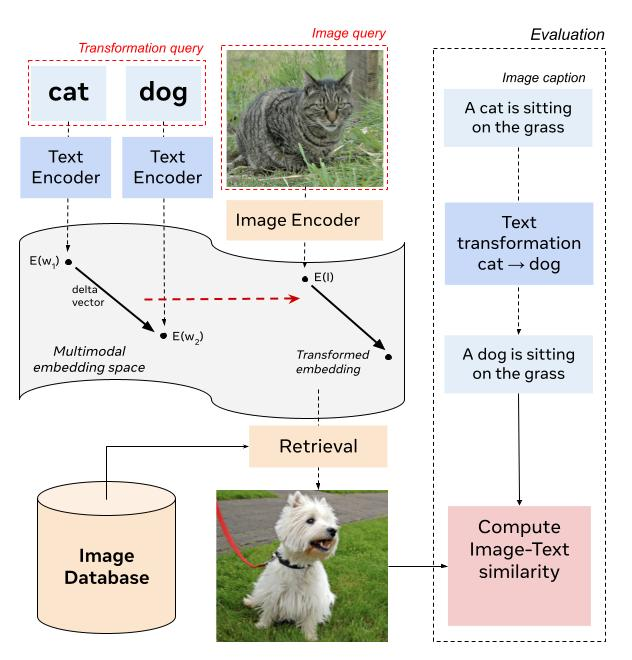
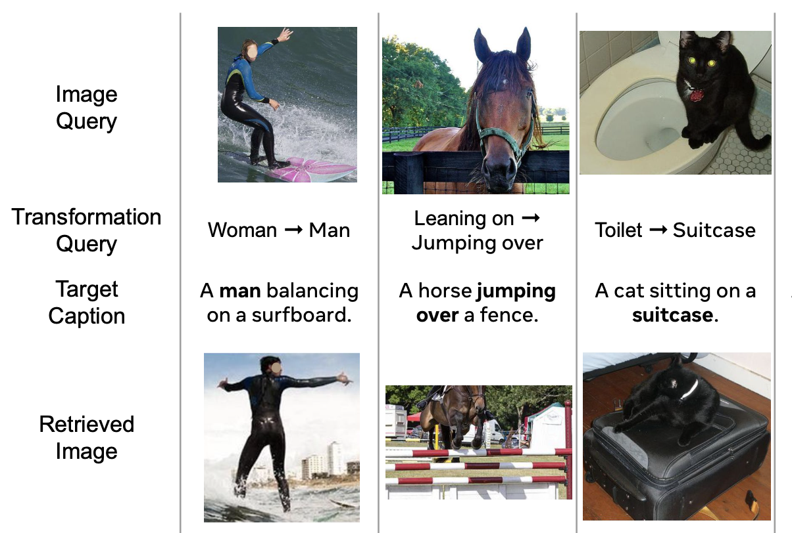

This repository contains the database and code used in the paper **Embedding Arithmetic for Text-driven Image Transformation**

(arxiv: ..)

The inspiration for the work are the geometric properties of word embeddings, such as Queen ~ Woman + (King - Man).
We extend this idea to multimodal embedding spaces (like CLIP), which let us semantically edit images via "delta vectors". 

Transformed images can then be retrieved in a dataset of images.

<p align="center">
    
</p>

## The SIMAT Dataset

We build SIMAT, a dataset to evaluate the task of text-driven image transformation, for simple images that can be characterized by a single subject-relation-object annotation. 
A **transformation query** is a pair (*image*, *query*) where the query asks to change the subject, the relation or the object in the input *image*.
SIMAT contains ~6k images and an average of 3 transformation queries per image.

The goal is to retrieve an image in the dataset that corresponds to the query specifications.
We use [OSCAR](https://github.com/microsoft/Oscar) as an oracle to check whether retrieved images are correct with respect to the expected modifications. 


## Examples

Below are a few examples that are in the dataset, and images that were retrieved for our best-performing algorithm.

<p align="center">
    
</p>

## Download dataset

The SIMAT database is composed of crops of images from Visual Genome. You first need to install Visual Genome and then run the following command :

```python
python prepare_dataset.py --VG_PATH=/path/to/visual/genome
```

## Perform inference with CLIP ViT-B/32

In this example, we use the CLIP ViT-B/32 model to edit an image. Note that the dataset of clip embeddings is pre-computed.

```python
import clip
from torchvision import datasets
from PIL import Image
from IPython.display import display

#hack to normalize tensors easily
torch.Tensor.normalize = lambda x:x/x.norm(dim=-1, keepdim=True)

# database to perform the retrieval step
dataset = datasets.ImageFolder('simat_db/images/')
db = torch.load('data/clip_simat.pt').float()

model, prep = clip.load('ViT-B/32', device='cuda:0', jit=False)

image = Image.open('simat_db/images/A cat sitting on a grass/98316.jpg')
img_enc = model.encode_image(prep(image).unsqueeze(0).to('cuda:0')).float().cpu().detach().normalize()

txt = ['cat', 'dog']
txt_enc = model.encode_text(clip.tokenize(txt).to('cuda:0')).float().cpu().detach().normalize()

# optionally, we can apply a linear layer on top of the embeddings
heads = torch.load(f'data/head_clip_t=0.1.pt')
img_enc = heads['img_head'](img_enc).normalize()
txt_enc = heads['txt_head'](txt_enc).normalize()
db = heads['img_head'](db).normalize()


# now we perform the transformation step
lbd = 1
target_enc = img_enc + lbd * (txt_enc[1] - txt_enc[0])


retrieved_idx = (db @ target_enc.float().T).argmax(0).item()


display(dataset[retrieved_idx][0])

```


## Compute SIMAT scores with CLIP


```python
python eval.py --backbone clip --domain dev --tau 0.01 --lbd 1 2
```


## Train adaptation layers on COCO

Coming Soon
